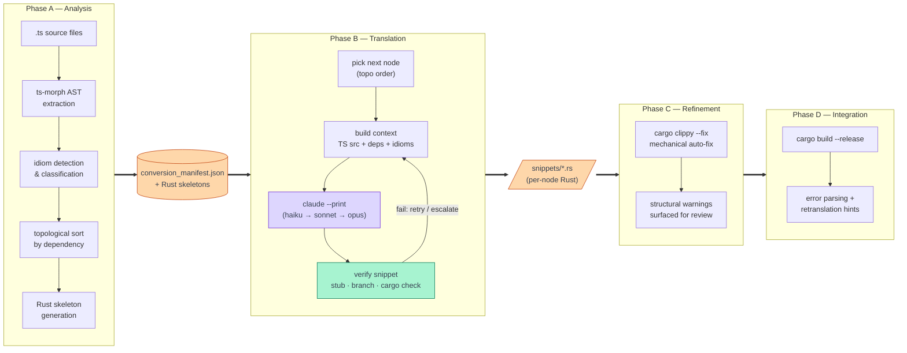
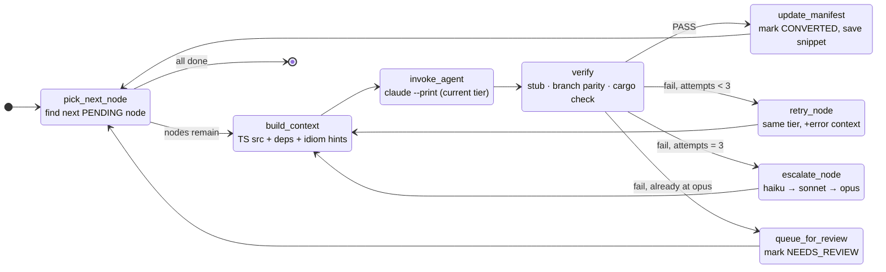

# oxidant

An agentic harness for automated TypeScript-to-Rust translation, powered by [LangGraph](https://github.com/langchain-ai/langgraph).

**[Documentation & Architecture →](https://bytebard97.github.io/oxidant/)**

## What It Does

Oxidant drives a four-phase pipeline that reads a TypeScript codebase, analyzes its structure, and produces idiomatic Rust — one function at a time, in dependency order, verified at every step.

## Pipeline

| Phase | What it does |
|-------|-------------|
| **A — Analysis** | ts-morph AST extraction, idiom detection, topological sort, tier classification, Rust skeleton generation |
| **B — Translation** | LangGraph loop: pick → prompt → `claude --print` → verify → retry/escalate → commit |
| **C — Refinement** | `cargo clippy` auto-fix for mechanical warnings; structural warnings surfaced for review |
| **D — Integration** | `cargo build --release`, error parsing, manifest intersection, retranslation hints |



## Quick Start

```bash
# Install (requires uv)
uv sync

# Full Phase A: extract AST, detect idioms, sort, classify, generate skeleton
oxidant phase-a --heuristic-tiers

# Phase B: translate all nodes in topological order
oxidant phase-b

# Smoke test (translate first 3 nodes only)
oxidant phase-b --max-nodes 3

# Phase C: Clippy refinement
oxidant phase-c

# Phase D: full build verification
oxidant phase-d
```

## Project Structure

```
oxidant/
├── src/oxidant/
│   ├── agents/          # Prompt construction (context.py) and Claude invocation
│   ├── analysis/        # Tier classification, skeleton generation
│   ├── assembly/        # Module assembly from converted snippets
│   ├── graph/           # LangGraph StateGraph (nodes.py, graph.py, state.py)
│   ├── integration/     # Phase D — full build error isolation
│   ├── models/          # Manifest schema (Pydantic)
│   ├── refinement/      # Phase C — Clippy auto-fix
│   ├── verification/    # Three-layer snippet verification
│   └── cli.py           # Typer CLI entry point
├── phase_a_scripts/     # ts-morph TypeScript scripts (A1 AST, A2 idioms)
├── snippets/            # Per-node .rs snippets output by Phase B
├── docs/                # GitHub Pages site
├── idiom_dictionary.md  # TS→Rust idiom guidance injected into prompts
└── oxidant.config.json  # Paths, model tiers, target repo config
```

## How Translation Works

Every translatable unit in the TypeScript codebase — class, method, function, interface, enum — becomes a node in `conversion_manifest.json`. Nodes are processed in topological order: by the time a node is translated, all its dependencies are already in Rust.

For each node, Phase B:
1. Assembles a prompt with the TS source, Rust skeleton signature, dependency snippets, and relevant idiom guidance
2. Calls `claude --print` as a subprocess (subscription auth — no API key needed)
3. Verifies the snippet: stub check → branch parity → `cargo check`
4. Retries with error context, escalating haiku → sonnet → opus if needed
5. Marks the node `CONVERTED` or queues it for human review



## License

MIT
