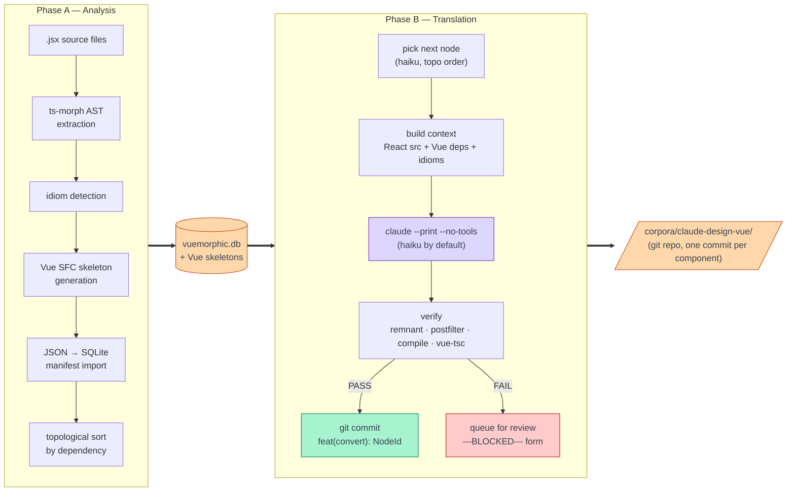
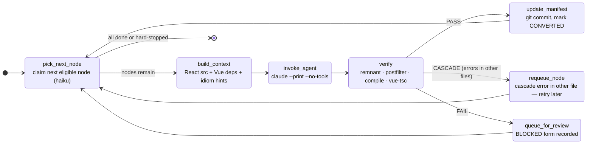

# vuemorphic

An agentic harness for automated React→Vue 3 SFC translation, powered by [LangGraph](https://github.com/langchain-ai/langgraph) and Claude Code.

## What It Does

Vuemorphic drives a two-phase pipeline that reads a React JSX codebase, analyzes its structure, and produces idiomatic Vue 3 Single File Components — one component at a time, in dependency order, verified at every step.

Built to port [Flora CAD](https://github.com/ByteBard97/flora) — a native-plants landscape design tool — from a React prototype to a Vue 3 production app.

## Pipeline

| Phase | What it does |
|-------|-------------|
| **A — Analysis** | JSX AST extraction, idiom detection, Vue skeleton generation, SQLite import, topological sort |
| **B — Translation** | LangGraph loop: pick → prompt → `claude --print` → verify → commit or queue for review |



## Quick Start

```bash
# Install (requires uv)
uv sync

# Phase A: extract AST, detect idioms, generate Vue skeletons, import to SQLite
vuemorphic phase-a --heuristic-tiers

# Phase B: translate all nodes in topological order (parallel, 10 workers)
vuemorphic phase-b

# Translate first 3 nodes only (for testing)
vuemorphic phase-b --max-nodes 3

# Inspect blocked nodes (failed with ---BLOCKED--- form)
vuemorphic blocked --db vuemorphic.db

# Manually escalate a blocked node to sonnet tier
vuemorphic escalate NodeId --db vuemorphic.db --tier sonnet
```

## Project Structure

```
vuemorphic/
├── src/vuemorphic/
│   ├── agents/          # Prompt assembly (context.py) and Claude invocation (invoke.py)
│   │   └── prompt_template.py  # Conversion prompt template (triple-quoted, easy to edit)
│   ├── analysis/        # Phase A: component_contracts.py extracts Vue-ready contracts
│   ├── graph/           # LangGraph StateGraph (nodes.py, graph.py, state.py)
│   ├── models/          # SQLite manifest (manifest.py, db.py) and ComponentContract
│   ├── skeleton/        # Vue SFC skeleton builder (script, template, style sections)
│   ├── verification/    # 5-tier Vue verification pipeline (verify.py)
│   └── cli.py           # Typer CLI entry point
├── phase_a_scripts/     # ts-morph JSX scripts (A1 AST extraction, A2 idiom detection)
├── corpora/             # Source React codebase + output Vue project (gitignored locally)
├── docs/                # Architecture docs and research
├── idiom_dictionary.md  # React→Vue idiom guidance injected into prompts
└── vuemorphic.config.json  # Paths, model tiers, parallelism config
```

## How Translation Works

Every React component in the source codebase becomes a node in `vuemorphic.db`. Nodes are processed in topological order: by the time a component is translated, all its dependencies are already in Vue.

For each node, Phase B:
1. Assembles a prompt with the React JSX source, Vue skeleton, converted dependency `.vue` files, and relevant idiom guidance
2. Calls `claude --print --no-tools` as a subprocess (Claude Max subscription auth — no API key needed)
3. Verifies the output through 5 tiers: React remnant check → postfilter → `@vue/compiler-sfc` parse → `vue-tsc --noEmit` → PASS
4. On PASS: `git commit` to the Vue project repo with the agent's summary as the commit message
5. On FAIL: queues for human review with the agent's structured `---BLOCKED---` diagnosis form



## Parallel Mode

Phase B runs multiple workers in parallel using git worktrees. Each worker gets an isolated copy of the Vue target project, converts and verifies independently, then cherry-picks its commits back to the main branch. No cascade cross-contamination between workers.

```bash
# Set parallelism in vuemorphic.config.json
{ "parallelism": 10, ... }

# Workers create corpora/claude-design-vue-worker-{N}/ automatically
# and clean up after themselves
```

## Failure Diagnosis

When an agent can't complete a conversion, it fills in a structured `---BLOCKED---` form:

```
---BLOCKED---
CATEGORY: info_gap | prompt_confusion | tooling | complexity | cascade | unknown
MISSING:  what specific information was absent
TRIED:    what approaches were attempted
FIX:      one concrete change to the harness or prompt that would help
```

This is stored in the DB and surfaced by `vuemorphic blocked`. Use `vuemorphic escalate` to manually promote a node to a higher model tier after reviewing the diagnosis.

## License

MIT
