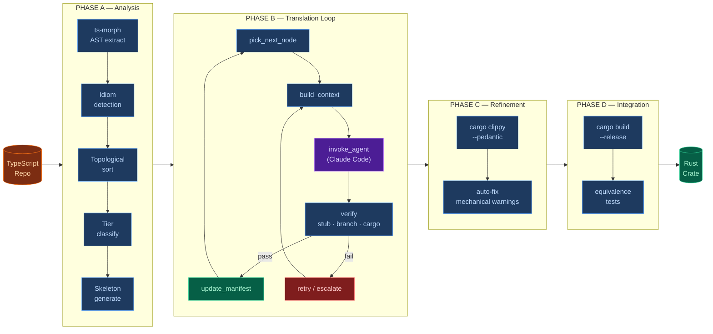

# Oxidant

**Agentic TypeScript → Rust translation harness**

Oxidant takes a TypeScript codebase and produces an idiomatic, compiling Rust codebase by orchestrating Claude Code subprocesses. It is not a transpiler — it controls agents. The agents do the actual conversion; Oxidant decides what to convert, in what order, with what context, and whether the output is acceptable.

The primary test corpus is **msagl-js** — Microsoft's TypeScript graph layout engine (~4,800 functions). One of the project authors previously spent 236 commits hand-translating it; Oxidant automates that process.

---

## Why this approach works

Naive file-by-file LLM prompting produces code that compiles in isolation but fails at integration. The approach is borrowed from the academic C-to-Rust literature (ORBIT, ENCRUST, SACTOR):

1. **Extract a full dependency graph first** — every function knows what it calls and what calls it
2. **Translate in topological order** — every dependency is already converted when a node is processed; the agent gets the real Rust signatures, not invented ones
3. **Verify each snippet with the real Rust compiler** before accepting it
4. **Separate correctness from idiomaticity** — Phase B produces working code; Phase C makes it idiomatic

---

## The four-phase pipeline

Phases are sequential at the top level. Phase B's internal loop is highly iterative — a node may be attempted multiple times at escalating model tiers before being accepted or queued for human review.

| Phase | What | How |
|-------|------|-----|
| **A — Analysis** | AST extraction → idiom detection → topological sort → tier classification → Rust skeleton | Deterministic (no AI) |
| **B — Translation** | Convert each node, verify, retry | LangGraph loop + Claude Code subprocess |
| **C — Refinement** | Make the output idiomatic | `cargo clippy` + targeted agents |
| **D — Integration** | Full build, equivalence tests | `cargo build --release` + delta debugging |

---

## Current status (msagl-js corpus)

| Metric | Value |
|--------|-------|
| Total nodes | 4,820 |
| Auto-converted structural nodes | 420 |
| Haiku-tier nodes | 1,196 |
| Sonnet-tier nodes | 3,476 |
| Opus-tier nodes | 148 |
| Class hierarchies handled | 22 (6 enums, 16 struct composition) |
