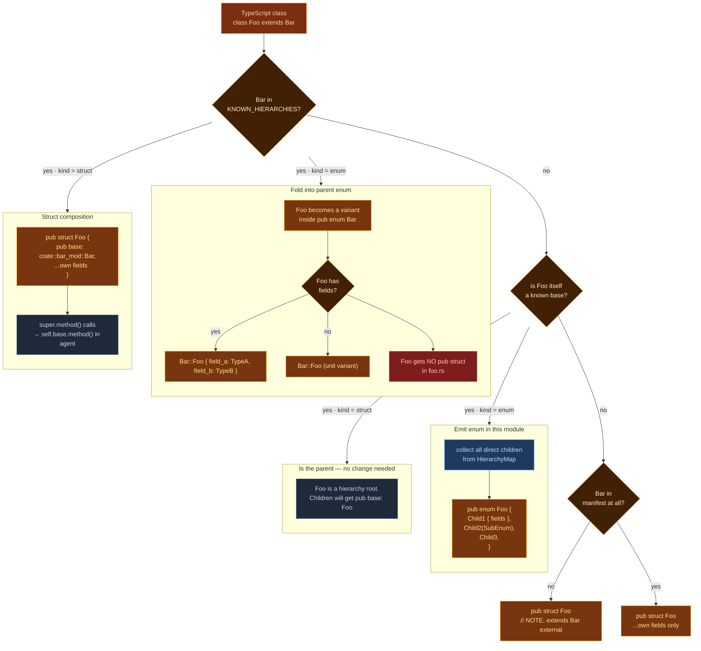

# Class Hierarchy Handling

msagl-js has **101 classes that use `extends`**, forming 22 distinct parent-child hierarchies. The skeleton generator classifies each hierarchy before emitting any Rust — because the correct Rust representation depends on *why* the hierarchy exists, not just that it exists.

Classification is hardcoded in `KNOWN_HIERARCHIES` inside `analysis/hierarchy.py`, validated against a manual Rust port of msagl-js (`Routers/msagl-rust`). It is **not** a heuristic — every hierarchy was checked by hand.

---

## Why this matters

Agents have no memory between invocations. Without a hierarchy-aware skeleton, every agent in a family like `SweepEvent` independently invents its own Rust representation — producing inconsistent, incompatible code. The scaffold locks in the right structure before any agent touches the code.

---

## Classification decision tree



## Category A — Discriminated unions → `pub enum`

These hierarchies have subclasses that each add 0–3 unique fields. TypeScript code dispatches on them using `instanceof` checks. In Rust, these **must** be enums — a flat struct has no runtime discriminant to match on.

**Classified as enum:** `SweepEvent`, `VertexEvent`, `BasicVertexEvent`, `BasicReflectionEvent`, `Layer`, `OptimalPacking`

The skeleton emits a single `pub enum` in the base class's `.rs` file. Each child class's fields become named fields of a variant. Child class `.rs` files emit no struct — they are folded into the parent enum.

=== "TypeScript (11 separate classes)"

    ```typescript
    class SweepEvent { }

    class AxisCoordinateEvent extends SweepEvent {
      site: Point;
    }

    class ConeClosureEvent extends SweepEvent {
      coneToCLose: Cone;
      site: Point;
    }

    class VertexEvent extends SweepEvent { }

    class OpenVertexEvent extends VertexEvent {
      vertex: PolylinePoint;
    }
    ```

=== "Rust skeleton (one enum in sweep_event.rs)"

    ```rust
    #[derive(Debug, Clone)]
    pub enum SweepEvent {
        AxisCoordinateEvent {
            site: Rc<RefCell<crate::point::Point>>,
        },
        ConeClosureEvent {
            cone_to_close: Rc<RefCell<crate::cone::Cone>>,
            site: Rc<RefCell<crate::point::Point>>,
        },
        // Sub-hierarchy VertexEvent is itself an enum — referenced as a tuple variant
        VertexEvent(crate::vertex_event::VertexEvent),
        // ...
    }
    ```

### Sub-hierarchies

When a child class is itself a hierarchy base (e.g. `VertexEvent` is a child of `SweepEvent` but also has its own subclasses), it gets its own `pub enum` in its own module and is referenced from the parent as a tuple variant:

```rust
// vertex_event.rs
#[derive(Debug, Clone)]
pub enum VertexEvent {
    BasicVertexEvent(crate::basic_vertex_event::BasicVertexEvent),
    LeftVertexEvent,
    LowestVertexEvent,
    RightVertexEvent,
}
```

### Type redirect table

When method signatures in other modules reference a now-folded child type (e.g. `PortObstacleEvent`), a redirect table (`_enum_child_redirect` in `generate_skeleton.py`) maps that name to the parent enum type (`crate::sweep_event::SweepEvent`) at type-mapping time, so cross-module method signatures still compile.

---

## Category B — Behavior hierarchies → struct composition

These hierarchies have subclasses that are large independent classes sharing a base. Each subclass gets its own `pub struct` with `pub base: ParentType` as the first field.

When agents convert methods that call `super.method()`, they write `self.base.method()`.

**Classified as struct:**

| Hierarchy | Subclasses | Notes |
|-----------|-----------|-------|
| `Algorithm` | 24 | Each is a large independent layout algorithm |
| `Attribute` | 4 | avg 22.5 fields each |
| `SegmentBase` | 3 | |
| `LineSweeperBase` | 3 | |
| `GeomObject` | 3 | |
| `BasicGraphOnEdges` | 2 | |
| `Entity` | 3 | Node/Edge/Graph used everywhere as distinct types |
| `Port` | 3 | CurvePort/FloatingPort used as distinct port types |
| `DrawingObject` | 2 | DrawingNode/DrawingEdge used standalone |
| `SvgViewerObject` | 2 | Used standalone in viewer |
| `ObstacleSide` | 3 | |
| `BasicObstacleSide` | 2 | Referenced in SweepEvent fields |
| `ConeSide` | 2 | ConeLeftSide/ConeRightSide used as field types |
| `VisibilityEdge` | 2 | AxisEdge used as a field type |
| `KdNode` | 2 | |
| `Packing` | 2 | |

=== "TypeScript"

    ```typescript
    class SplineRouter extends Algorithm {
      continueOnOverlaps: boolean;
      obstacleCalculator: ShapeObstacleCalculator;

      run() {
        super.run();
        // spline-specific logic
      }
    }
    ```

=== "Rust skeleton"

    ```rust
    #[derive(Debug, Clone)]
    pub struct SplineRouter {
        // base field always first; cross-module path
        pub base: crate::algorithm::Algorithm,
        pub continue_on_overlaps: bool,
        pub obstacle_calculator: Rc<RefCell<
            crate::shape_obstacle_calculator::ShapeObstacleCalculator
        >>,
    }

    // Agent writes: self.base.run();
    ```

---

## External parents

If a class extends a type that is not in the manifest corpus (e.g. browser built-ins like `EventSource`), the skeleton emits a comment rather than a field:

```rust
pub struct MyClass {
    // NOTE: extends EventSource (external — not in corpus)
    pub some_field: String,
}
```
