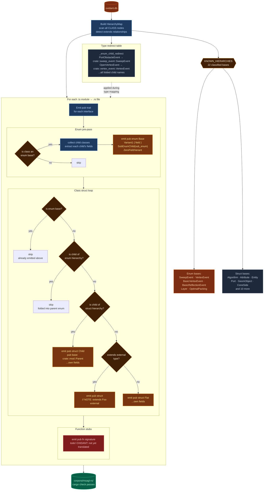

# Phase A — Analysis & Skeleton Generation

Phase A is entirely deterministic — no AI involvement. It produces all the structured inputs Phase B requires.

---

## A1 — AST Extraction (`phase_a_scripts/extract_ast.ts`)

A ts-morph TypeScript script parses the entire source codebase and populates `oxidant.db`. ts-morph was chosen specifically for its **cross-file type resolution** — when a method in `GeomGraph` accepts a `GeomNode` parameter from another module, ts-morph resolves that type fully and records it as a dependency edge.

**Node kinds extracted:**

| Kind | Description |
|------|-------------|
| `class` | Class definition (fields only, no method bodies) |
| `constructor` | Constructor body |
| `method`, `getter`, `setter` | Individual method bodies |
| `free_function` | Module-level functions |
| `interface` | TypeScript interface (becomes a Rust trait) |
| `enum` | TypeScript enum (becomes a Rust enum) |
| `type_alias` | TypeScript type aliases |

For each node, the extractor records: unique node ID, source file path, line range, full source text, parameter types, return type, type-level and call-level dependency edges, cyclomatic complexity, and BFS level.

---

## A2 — Idiom Detection (`phase_a_scripts/detect_idioms.ts`)

A second ts-morph pass scans each node's AST for 14 patterns known to require non-trivial Rust translation. Each detected pattern is stored in `idioms_needed[]` on the node and used in Phase B to inject relevant guidance into the conversion prompt.

See [Idiom Detection](../reference/idioms.md) for the full list and translation guidance.

---

## A3 — Topological Sort

Nodes are sorted so that when a node is translated, every node it depends on has already been translated. The resulting Rust signatures of dependencies are available to the agent in the prompt — eliminating guesswork about what the API looks like. This is the single biggest driver of translation quality.

---

## A4 — Tier Classification (`analysis/classify_tiers.py`)

Each node is assigned a translation tier based on cyclomatic complexity, idiom count, and node kind:

| Tier | Model | Nodes (msagl-js) | Max attempts |
|------|-------|----------|--------------|
| `haiku` | claude-haiku-4-5 | 1,196 | 3 |
| `sonnet` | claude-sonnet-4-6 | 3,476 | 4 |
| `opus` | claude-opus-4-6 | 148 | 5 |

If a node exhausts its retry budget it escalates to the next tier. A haiku node that fails 3 times is re-tried as sonnet; sonnet after 4 failures escalates to opus; opus after 5 failures goes to the human review queue.

---

## A5 — Skeleton Generation (`analysis/generate_skeleton.py`)

A Python script reads `oxidant.db` and writes a complete, compilable Rust project to `corpora/msagl-rs/`. The skeleton must pass `cargo check` before Phase B begins.

**What the skeleton contains:**

- `Cargo.toml` with the approved crate inventory
- `src/lib.rs` with `pub mod` declarations for every module
- One `.rs` file per TypeScript source file
- `pub struct` / `pub enum` / `pub trait` / `pub fn` declarations for every node
- `todo!("OXIDANT: not yet translated — <node_id>")` as the body of every function

The count of remaining `todo!()` macros is the primary progress metric throughout Phase B.

### TypeScript → Rust type mapping

Cross-module references use fully-qualified `crate::module::Type` paths so no `use` imports are needed.

| TypeScript | Rust |
|-----------|------|
| `number` | `f64` |
| `string` | `String` |
| `boolean` | `bool` |
| `T[]` / `Array<T>` | `Vec<T>` |
| `Map<K,V>` | `std::collections::HashMap<K,V>` |
| `Set<T>` | `std::collections::HashSet<T>` |
| `T \| null` | `Option<T>` |
| DOM/Web API types | `serde_json::Value` |
| User class `Foo` (same module) | `Rc<RefCell<Foo>>` |
| User class `Foo` (other module) | `Rc<RefCell<crate::module::Foo>>` |
| TypeScript interface `IFoo` | `Rc<dyn IFoo>` |

For class hierarchies, the skeleton emits `pub enum` or `pub base:` fields depending on the hierarchy kind. See [Class Hierarchies](hierarchies.md).
