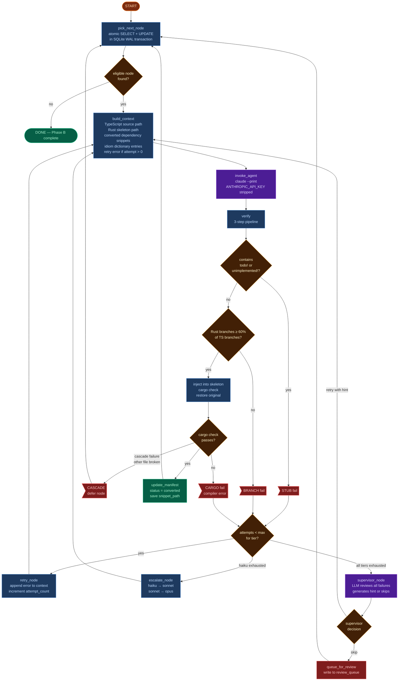

# Phase B — Translation Loop

Phase B is a **LangGraph `StateGraph`** that iterates over the manifest in topological order. Each iteration picks one eligible node, builds a context-rich prompt, calls Claude Code as a subprocess, verifies the output, and either accepts it or retries.

---

## Graph structure



### Node descriptions

```
pick_next_node
  │  Atomically claims the next eligible node from SQLite.
  │  Eligible = NOT_STARTED + all dependencies are CONVERTED.
  │  In single-worker mode, also resets orphaned IN_PROGRESS nodes.
  ↓ (done → END)

build_context
  │  Assembles the full conversion prompt from the manifest node,
  │  dependency snippets, idiom entries, and any retry context.
  ↓

invoke_agent
  │  Runs: claude --print --output-format json <prompt>
  │  ANTHROPIC_API_KEY is stripped before invocation (see below).
  ↓

verify
  │  Three checks: stub → branch parity → cargo check.
  ↓ (conditional routing)

  ├─ PASS → update_manifest → pick_next_node
  │
  ├─ STUB / BRANCH (under attempt limit)
  │     → retry_node → build_context (with error context)
  │
  ├─ CARGO (under attempt limit)
  │     → retry_node → build_context (with compiler error)
  │
  ├─ (haiku limit hit) → escalate_node (→ sonnet) → build_context
  ├─ (sonnet limit hit) → escalate_node (→ opus) → build_context
  ├─ (opus limit hit) → supervisor_node → build_context or queue_for_review
  │
  └─ (all tiers exhausted) → queue_for_review → pick_next_node
```

---

## Prompt structure

Every prompt is assembled fresh for each attempt by `agents/context.py`. The prompt tells the agent to:

1. Read the TypeScript source file to understand the function
2. Read the Rust skeleton file to see available types and signatures
3. Implement only the one function body marked by `todo!("OXIDANT: not yet translated — <node_id>")`
4. Run `cargo check` in the skeleton directory and fix errors
5. Output the final function body text (no markdown fences) when done

**Prompt sections:**

| Section | Always present | Contents |
|---------|---------------|----------|
| Task description | Yes | Which node, which files, the todo marker to replace |
| Rules | Yes | No `todo!()`, pure ASCII, faithful translation, only approved crates |
| Architectural Decisions | Yes | From `oxidant.config.json` (e.g. graph ownership strategy) |
| Converted Dependencies | If deps exist | Rust snippet bodies for all functions this node calls |
| Idiom Translations | If idioms detected | Relevant sections from `idiom_dictionary.md` |
| Previous Attempt Failed | On retry | The exact cargo check or verification error |
| Supervisor Hint | If provided | Hint injected after supervisor review |

### Converted dependencies

The `## Converted Dependencies` section is loaded by `_load_dep_snippets()` in `context.py`. It follows both `call_dependencies` and `type_dependencies` from the manifest node, looks up each dependency's `snippet_path` in the DB, and reads the saved `.rs` file from disk.

This means agents always see the *actual Rust implementation* of everything they call — not just a signature stub. Topological ordering guarantees every dependency is already converted before the current node is attempted.

---

## Max subscription auth

Claude Code is invoked as a subprocess, not via the Python SDK:

```python
env = os.environ.copy()
env.pop("ANTHROPIC_API_KEY", None)   # force Max subscription auth

subprocess.run(
    ["claude", "--print", "--output-format", "json", prompt],
    env=env,
    cwd=workspace,
    timeout=300,
)
```

Stripping `ANTHROPIC_API_KEY` forces Claude Code to use the user's Max subscription rather than billing to the API account. **If the key is present, charges accrue to the API account — this has caused accidental charges of $1,800+ for other users.**

---

## Parallelism

Multiple worker processes can run simultaneously. Each worker uses its own clone of the skeleton project at `target_path/.clone_N/` so concurrent `cargo check` invocations don't race on the same files. The `claim_next_eligible()` SQL transaction is atomic — no two workers ever claim the same node.

`setup_worker_clones()` in `graph/nodes.py` creates the clones at startup by copying `src/` and `Cargo.toml`.

---

## Serving mode (`oxidant serve`)

`oxidant serve` starts a FastAPI server that exposes Phase B over HTTP, allowing a Vue 3 GUI to control and monitor runs without a terminal. In serve mode, the graph uses `SqliteSaver` as the LangGraph checkpointer, enabling durable resume of interrupted runs.

**Endpoints:**

| Endpoint | Description |
|----------|-------------|
| `POST /run` | Start or resume a Phase B run |
| `GET /stream/{thread_id}` | SSE stream of progress events |
| `POST /pause/{thread_id}` | Pause after the current node |
| `POST /resume/{thread_id}` | Resume after a supervisor interrupt |
| `GET /review-queue` | Nodes awaiting human review |
| `GET /status/{thread_id}` | Run status snapshot |
