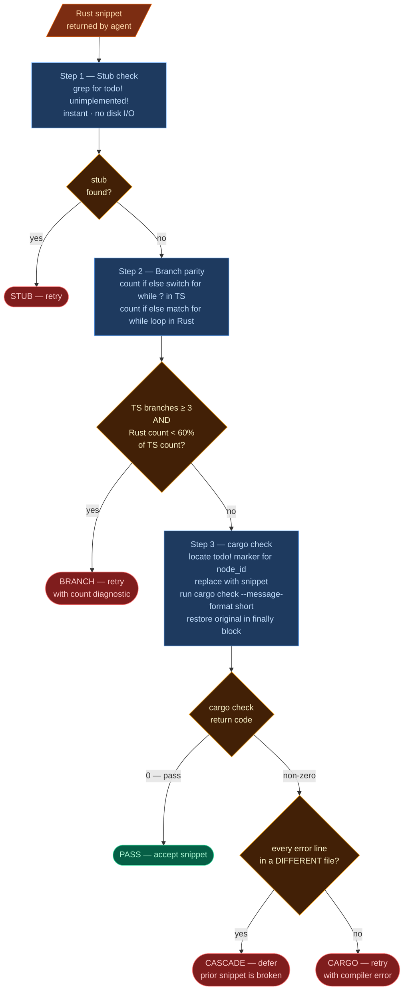

# Verification



Every translated snippet passes three checks before being accepted, ordered cheapest-first. The first failure short-circuits — no point running `cargo check` if the snippet still contains `todo!()`.

---

## Step 1 — Stub check

Greps for `todo!()` or `unimplemented!()` in the returned snippet. Agents are explicitly instructed not to use these, but they occasionally slip through on complex nodes. **Instant fail.**

---

## Step 2 — Branch parity

Counts branch constructs in both the TypeScript source and the Rust output and checks that the Rust has at least 60% as many:

| Language | Constructs counted |
|----------|--------------------|
| TypeScript | `if`, `else`, `switch`, `case`, `for`, `while`, `?` (ternary) |
| Rust | `if`, `else`, `match`, `for`, `while`, `loop` |

The check only triggers when the TypeScript source has **3 or more** branch constructs. Below that threshold, a simpler Rust translation is plausible (e.g. a single `if/else` chain becoming a `match`).

**Why this exists:** LLM agents consistently try to simplify code during translation — collapsing branches, dropping edge cases, restructuring logic. This check catches the most common form of that failure (missing branches) cheaply, before spending time on cargo check.

---

## Step 3 — cargo check (inject and restore)

```
1. Locate todo!("OXIDANT: not yet translated — <node_id>") in the skeleton .rs file
2. Replace it with the snippet
3. Run: cargo check --message-format=short  (whole project)
4. Always restore the original file (finally block — even on crash)
5. Classify the result
```

**Why `cargo check` on the whole project, not just the file?**

Every unconverted function in the skeleton is a `todo!()` stub with a correct signature. When the new snippet is injected and `cargo check` runs, it type-checks the snippet against the real API of everything it touches — other structs, traits, enums — catching type boundary mismatches immediately rather than at final integration.

**Cascade detection:** If `cargo check` fails but every error line implicates a file *other than* the target, the failure is a cascade from a previously-converted (broken) snippet, not from the new snippet. The result is classified as `CASCADE` rather than `CARGO` — the node is deferred and retried later when the broken dependency is fixed.

### Smoke check on restore failure

If the original file cannot be restored cleanly (which would leave the skeleton in a broken state), an error is logged at `ERROR` level. This is a safeguard — it should never happen under normal operation, but if it does, manual intervention is required before continuing.

---

## Result routing

| Status | Meaning | Action |
|--------|---------|--------|
| `PASS` | All three checks passed | Accept snippet, mark node `converted` |
| `STUB` | `todo!()` found in snippet | Retry with error context |
| `BRANCH` | Too few branches vs TypeScript | Retry with branch count diagnostics |
| `CARGO` | Compilation error in target file | Retry with exact compiler error |
| `CASCADE` | Compilation error in *other* file | Defer; retry later |
